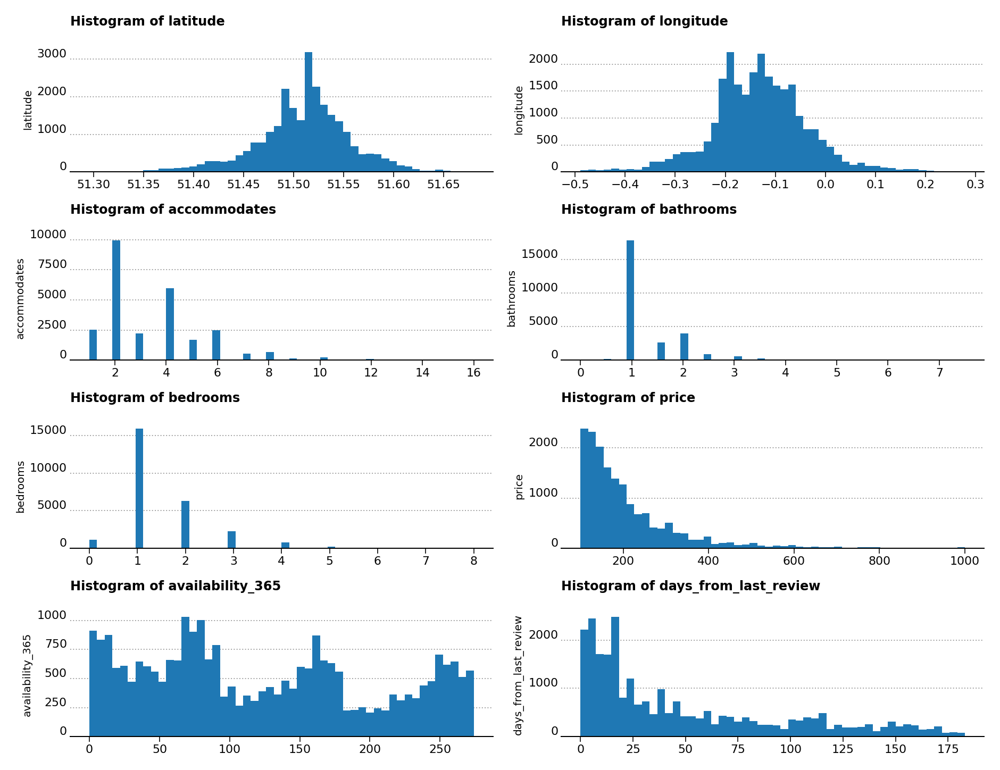

# Project on short term rentals in London UK

## Summary

One of the major challenges for letting agencies and private citizens alike is to determine the correct market price for their short-term property listings. Prices that are too low may result in a lost of potential revenue, while prices that are too high may result in too few bookings. Moreover, there are no free services that provide an accurate price estimation for property listings. Using data from [Inside Airbnb](https://insideairbnb.com/ "https://insideairbnb.com/"), a data and advocacy website about Airbnb's impact on residential communities, and from other public data sources, I've built a [Streamlit](https://streamlit.io/ "https://streamlit.io/") web app to estimate the short-term rental prices for property listings based on their characteristics and location in London UK for December 2024. On average the web app estimates a percentage difference of 32.4% between actual and predicted rent price. If you're curious, take a look at the web app at the link below.

[Short-Term Rental Price Estimator &bull; Streamlit](https://rental-pricing-app.streamlit.app/ "https://rental-pricing-app.streamlit.app/")

## Data Sources

### Short-Term Housing Data

Due to the terms of service of major UK home realtors which don't permit web scraping, I decided to use the [Inside Airbnb](https://insideairbnb.com/london/ "https://insideairbnb.com/london/") website and filter the data on short-term rentals of entire flats or buildings for London, UK. The data set is anonymously scraped from Airbnb host profiles in a number of major international cities. The data for London itself can be found here at the [webpage for London](https://insideairbnb.com/london/ "https://insideairbnb.com/london/"). The specific data set used in this analysis was scraped 11 December 2024. Because of [planning regulations in the Greater London area](https://www.gov.uk/government/news/short-term-lets-rules-to-protect-communities-and-keep-homes-available "https://www.gov.uk/government/news/short-term-lets-rules-to-protect-communities-and-keep-homes-available") made to protect communities and keep homes available, short-term rentals are limited to 90 nights per year.

For the analysis I employed several features of the Inside Airbnb data set, notably the borough of the property location, the property and room types, the amount of people the property can accomodate, the number of bedrooms and bathrooms, the price per night, the availability of the property over the last year, the number of days from the last review (if any), and latitude and longitude of the property. For the purposes of anonymity, these geographic coordinates are randomly offset by 150 meters.

Beyond the main data source from Inside Airbnb, the data were also enriched by adding crime rate per borough, distance of the property to the nearest Tube Underground station, and local amenities in the vicinity of the property. Here follows a more detailed list of them.

### Crime Data

The crime rate data by London borough are retrieved from the [CrimeRate](https://crimerate.co.uk/ "https://crimerate.co.uk/") webpage for the [Greater London Crime Statistics](https://crimerate.co.uk/london "https://crimerate.co.uk/london") website. It regards the crime rate in each borough over the period from October 2023 to September 2024.

### Transport Data

I added the distances from each rental unit to the closest Tube Underground station using the `StopPoint` [endpoint](https://api.tfl.gov.uk/StopPoint/Mode/tube "https://api.tfl.gov.uk/StopPoint/Mode/tube") from the Transport for London (TfL) developer API, from which I extracted the geographic coordinates of each Tube station. Afterwards, I calculated the distance from the nearest Tube station to the rental unit using the [GeoPy](https://github.com/geopy/geopy "https://github.com/geopy/geopy") Python package.

### Amenities Data

I also retrieved data on the amenities located in the vicinities of the property rentals using [Foursquare](https://foursquare.com/ "https://foursquare.com/"). Specifically, I used the `Place/Search` endpoint, the details of which can be found [at the Foursquare API](https://api.foursquare.com/v3/places/search "https://api.foursquare.com/v3/places/search"). At most three amenity categories for each property location are retrieved using the Foursquare API, which are then set to one of ten broad category types. These types can be easily viewed in the web app under one of the `Nearby amenity category` drop-drop menus.

## Data Preparation

For the purposes of the data preparation, null values were removed from the data set and only properties reviewed within the last six months were retained in the data set. Also just the most frequent property types, present at least 30 times, were kept for the analysis. These types can be easily selected and viewed in the web app under the `Property Type` drop-drop menu.

As one can see from Figure 1, the histogram of the price distribution of short-term rentals is heavily skewed towards the positive end of the _x_ axis, so for the machine learning model generation the price feature was transformed into the logarithm of the price feature plus 1. This new feature is much more normally distributed compared to the previous feature, and helps to produce machine learning models with more accurate predictions.

## Exploratory Data Analysis

A few initial observations can already be gleaned from the series of histograms in Figure 1. The top two histograms of latitude and logitude show a bimodal distribution that can be ascribed primarily to the Thames river for the first histogram, but is harder to ascertain for the second. This could be due to the presence of more property listings around the major London parks, mostly present in the east and west of the city.

From the price histogram we observe a sharp drop in short-term rental prices per night, with a distribution heavily skewed towards the positive _x_ axis. I chose to limit the _x_ axis to £1000 as the upper limit, but there are several outliers that are even further up in price. These outliers are also removed in the model analysis. A similar distribution behavior is visible in the histogram for the number of days from the last review.

### Borough Plots

Which boroughs have the most short-term rental properties? From Figure 2 one sees that most short-term rentals are present in the borough of Westminister, with Kensington & Chelsea, Camden, and Tower Hamlets listed in second, third, and fourth places respectively. The borough with the least number of rentals is Sutton.

Which boroughs have the highest median price? The highest median prices can be found unsurprisingly to Kensington & Chelsea, which is the borough with the most exclusive and expensive properties of the city, followed closely by the boroughs of Westminster, Camden and Lambeth.

What property features are correlated with rent prices? From the bar plot of the property features, we can see that many features have a positive correlation with price. However, adding the parking option to properties doesn't correspond to an increase of rent prices. Moreover, there is very little price difference between properties that offer storage and those that don't.

### Cluster Analysis

An analysis of possible clusters of rental properties in London was undertaken by finding the number of clusters that maximized the [Silhouette coefficient](https://en.wikipedia.org/wiki/Silhouette_(clustering) "https://en.wikipedia.org/wiki/Silhouette_(clustering)"). The maximum Silhouette score (0.524) is achieved with just one big cluster of properties that covers the entire city, with no other discernible subclusters visible. The maximum Silhouette score was calculated using [DBSCAN](https://scikit-learn.org/stable/modules/generated/sklearn.cluster.DBSCAN.html#sklearn.cluster.DBSCAN "https://scikit-learn.org/stable/modules/generated/sklearn.cluster.DBSCAN.html#sklearn.cluster.DBSCAN") in Scikit-Learn and `eps=0.03` and `min_sample=400`. Fine-tuning the `eps` and `min_sample` parameters, which are the most important parameters for DBSCAN, doesn't offer more than one cluster even at the expense of lower Silhouette scores.

## Model Generation

A few regression algorithms from [Scikit-Learn](https://scikit-learn.org/stable/ "https://scikit-learn.org/stable/") were used to model the data. These were [linear regression](https://scikit-learn.org/stable/modules/generated/sklearn.linear_model.LinearRegression.html "https://scikit-learn.org/stable/modules/generated/sklearn.linear_model.LinearRegression.html"), [random forest regressor](https://scikit-learn.org/stable/modules/generated/sklearn.ensemble.RandomForestRegressor.html#sklearn.ensemble.RandomForestRegressor "https://scikit-learn.org/stable/modules/generated/sklearn.ensemble.RandomForestRegressor.html#sklearn.ensemble.RandomForestRegressor"), [stocastic gradient descent regressor](https://scikit-learn.org/stable/modules/generated/sklearn.linear_model.SGDRegressor.html#sklearn.linear_model.SGDRegressor "https://scikit-learn.org/stable/modules/generated/sklearn.linear_model.SGDRegressor.html#sklearn.linear_model.SGDRegressor"), [support vector regressor](https://scikit-learn.org/stable/modules/generated/sklearn.svm.SVR.html#sklearn.svm.SVR "https://scikit-learn.org/stable/modules/generated/sklearn.svm.SVR.html#sklearn.svm.SVR") and [XGBoost regressor](https://xgboost.readthedocs.io/en/stable/python/python_api.html#xgboost.XGBRegressor "https://xgboost.readthedocs.io/en/stable/python/python_api.html#xgboost.XGBRegressor"). The performance of the best algorithm was determined based on the highest $R^2$. Of the data algorithms used, the support vector regressor and the random forest regressor achieved the best $R^2$ scores of 0.636 on the validation data set.

### RMSE And $R^2$ Validation Performance For All Models

|                 Model                |   RMSE  |  $R^2$  |
|--------------------------------------|---------|---------|
| Linear regression                    |  81.82  |  0.587  |
| Random forest regressor              |  76.74  |  0.636  |
| Stocastic gradient descent regressor |  82.16  |  0.583  |
| Support vector regressor             |  76.77  |  0.636  |
| XGBoost regressor                    |  77.56  |  0.629  |

5-fold cross-validation RMSE and $R^2$ results were also calculated. Here the support vector regressor and the random forest regressor both achieved the highest $R^2$ scores of 0.622. In the end, the decision to select the support vector regressor was solely based on the faster compute time for this algorithm.

### Cross-Validation RMSE And $R^2$ Results

|                 Model        |  RMSE Mean |   $R^2$   |
|------------------------------|------------|-----------|
| Linear Regression            |    78.54   |   0.587   |
| Random Forest Regressor      |    75.15   |   0.622   |
| Stochastic Gradient Descent  |    79.16   |   0.580   |
| Support Vector Regressor     |    75.16   |   0.622   |
| XGBoost Regressor            |    76.36   |   0.609   |

### Grid-Search Analysis

A grid search analysis on the support vector regressor with `C=1.0` and `epsilon=0.1` produced the lowest RMSE values, which was the metric employed to determine the best parameters. These are also happen to be the default values for the support vector regressor in Scikit-Learn. Calculating the corrected paired t-test and the uncorrect paired t-test for the first two sets of grid-search parameters yielded a statistically significant difference between the first and second sets of grid-search parameters, validating the selection of the first set of parameters with `C=1.0` and `epsilon=0.1`. More can be found on the [Scikit-Learn web site concerning grid search analysis](https://scikit-learn.org/stable/auto_examples/model_selection/plot_grid_search_stats.html#sphx-glr-auto-examples-model-selection-plot-grid-search-stats-py "https://scikit-learn.org/stable/auto_examples/model_selection/plot_grid_search_stats.html#sphx-glr-auto-examples-model-selection-plot-grid-search-stats-py").

### Support vector regressor using test dataset

Finally, using the grid-search parameters from above and the test data, the $R^2$ for the support vector regressor returned a slightly better value of 0.649, and a slightly lower value of the RMSE of 72.03. I've also calculated the mean absolute error (40.54) and the mean absolute percentage error. This latter shows that on average there is a 25.2% difference between actual and predicted rental prices. This gives an idea of the expected error on predictions from the model.

| Metric   | Value   |
|----------|---------|
| MAE      |  40.54  |
| MAPE     |  25.2%  |
| RMSE     |  72.03  |
| $R^2$    |  0.649  |

### Residual statistics (log-price & price)

The mean and residual standard error of the price (in GBP) is 149.66 ± 48.54 (lower end 101.12, upper end 198.2). The error percentage of the residual standard error to the mean is 32.4%. This is the expected average variation of the price compared to the regression line.

| Description                             | Value          |
|-----------------------------------------|----------------|
| Mean Log Price                          | 4.84           |
| Residual Std. Error (Log Price)         | 0.35           |
| Mean Price (£)                          | 149.66         |
| Residual Std. Error (£)                 | 48.54          |
| Price Interval (£)                      | 101.12, 198.2  |
| Residual Std. Error as % of Mean Price  | 32.4%          |

### OLS Regression Summary

[Ordinary least squares (OLS)](https://www.statsmodels.org/stable/index.html/generated/statsmodels.regression.linear_model.OLS.html#statsmodels.regression.linear_model.OLS "https://www.statsmodels.org/stable/index.html/generated/statsmodels.regression.linear_model.OLS.html#statsmodels.regression.linear_model.OLS") from [Statsmodels](https://www.statsmodels.org/stable/index.html "https://www.statsmodels.org/stable/index.html") allows us to calculate the F-statistic to determine the likelihood of association between the predictors and the outcome. In the regression results the F-statistics returns a value of 902.5 >> 1, and points to a very high association between at least one predictor and the outcome.

| Statistic                      | Value        |
|--------------------------------|--------------|
| Dependent Variable             | log_price    |
| R-squared                      | 0.741        |
| Adjusted R-squared             | 0.741        |
| F-statistic                    | 902.5        |
| Prob (F-statistic)             | 0.00         |
| Observations                   | 26,532       |
| Degrees of Freedom (Model)     | 84           |
| Degrees of Freedom (Residuals) | 26,447       |
| Log-Likelihood                 | -9492.1      |
| AIC                            | 19,150       |
| BIC                            | 19,850       |
| Covariance Type                | Nonrobust    |

## Conclusions

The project was really enjoyable, and the part I liked the most was creating a new data set by data enrichment from other data sources. Once the model was generated, I set up an interactive web app with [Streamlit](https://streamlit.io/cloud "https://streamlit.io/cloud") that allows users to determine the nightly price for their short-term rental properties according to the features described above. Check it out at:

[Short-Term Rental Price Estimator &bull; Streamlit](https://rental-pricing-app.streamlit.app/ "https://rental-pricing-app.streamlit.app/")

For the data analysis, the following software packages were used: [Scikit-Learn](https://scikit-learn.org/stable/ "https://scikit-learn.org/stable/") (version 1.6.1), [Matplotlib](https://matplotlib.org/ "https://matplotlib.org/") (version 3.10.0), [Statsmodels](https://www.statsmodels.org/stable/index.html "https://www.statsmodels.org/stable/index.html") (version 0.14.4), [XGBoost](https://xgboost.readthedocs.io/en/stable/ "https://xgboost.readthedocs.io/en/stable/") (version 3.0.1), [contextily](https://github.com/geopandas/contextily "https://github.com/geopandas/contextily") (version 1.6.2), [GeoPy](https://github.com/geopy/geopy "https://github.com/geopy/geopy") (version 2.4.1), [GeoPandas](https://geopandas.org/en/stable/ "https://geopandas.org/en/stable/") (version 1.0.1), [Shapely](https://github.com/shapely/shapely "https://github.com/shapely/shapely") (2.0.6), [Streamlit](https://streamlit.io/cloud "https://streamlit.io/cloud") (version 1.45.0), [Pandas](https://pandas.pydata.org/ "https://pandas.pydata.org/") (version 2.2.3), [joblib](https://joblib.readthedocs.io/en/stable/ "https://joblib.readthedocs.io/en/stable/") (version 1.4.2) and [NumPy](https://numpy.org/ "https://numpy.org/") (version 1.26.4).
